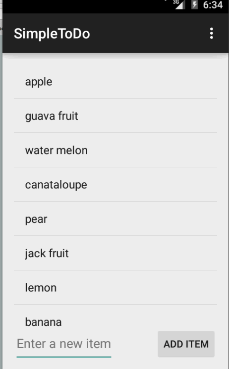

# Simple TODO Demo

This is an Android demo application for maintaining a TODO list.

Time spent: 6 hours spent in total

Completed user stories:

 * [x] Required: User can view a list of TODOs
 * [x] Required: User can long click on a TODO to delete
 * [x] Required: User can add a TODO
 * [x] Required: User can click to edit a TODO
 * [x] Required: User can persist the TODO list which is automatically reloaded at start up
    
    Notes:

    Spent some time making the UI work across multiple phone resolutions by playing around with the RelativeLayout.

    Walkthrough of all user stories:

    

    GIF created with [LiceCap](http://www.cockos.com/licecap/).

